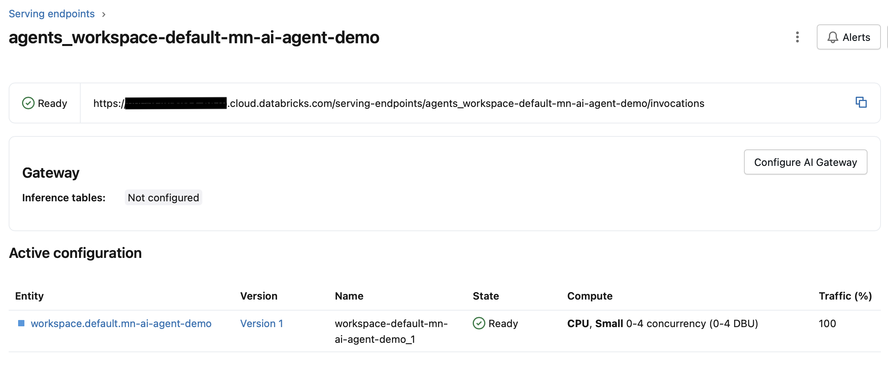

## TL;DR — The Cost-Saving Tip

If you’re deploying AI agents in Databricks using the Responses Agent Framework, clean up your old agent versions.

Every redeploy creates a new agent version associated with the endpoint. Even if those older versions receive 0% of traffic, Databricks still allocates compute to keep them alive. Over time, those unused versions can silently drive up your costs.

Deleting unused versions cut our agent serving costs by ~50%.

## The Mystery: Similar Agents, Very Different Costs

This story begins as a colleague and I were monitoring our AI agent costs using a Databricks cost dashboard we'd set up for our serving endpoints to keep an eye on spend.

That’s when we noticed something strange.

Some agent endpoints were significantly more expensive than others, even though:

- They followed the same overall structure and deployment pattern
- The more expensive agents weren't doing significantly more computation than the cheaper ones

These weren’t fundamentally different systems. They were variations on the same pattern. Yet the cost differences were hard to ignore.

## The Red Flag: Development Was More Expensive Than Production

The real red flag appeared when we compared environments. 

In several cases, the same agent deployed to dev, QA, and prod showed dramatically different costs—and counterintuitively, production was cheaper than development, despite handling more requests.

In several cases, the same agent deployed to dev, QA, and Prod showed dramatically different costs. Even more counterintuitive, production was cheaper (sometimes significantly cheaper) than development, despite handling more requests. 

This immediately told us this wasn't a straightforward usage problem. If production traffic was higher but the baseline cost was lower, then something structural, not workload-driven, had to be influencing the spend.

## Our First Approach: Revisiting the Documentation

Our first step was to revisit the documentation.

To Databricks’ credit, the documentation around agent deployment and serving endpoints is strong, especially given how new this functionality is. However, it didn't answer the question we were trying to solve.

We couldn’t find anything that explained why similarly structured agents, deployed across different environments, could have such large cost discrepancies, or what underlying factors might cause that behavior.

That's not a knock on the docs. It's more a reflection of how cutting-edge this part of the platform is. When features are this new, operational details only surface once people start running them at scale.

With no clear explanation to point us in the right direction, the only option left was to start forming hypotheses and testing them against real data.

## Hypothesis #1: Streaming v. Non-Streaming Agents

Our first theory was that streaming agents might be more expensive than non-streaming ones.

It sounded reasonable:

- Streaming keeps connections open longer
- It feels like it should consume more resources
- The billing model isn’t always obvious

To test this, we compared the cost of non-streaming agents with streaming-enabled agents that had comparable usage patterns.

What we found was that the non-streaming endpoints tracked almost identically in cost to their streaming counterparts. There was no meaningful difference that suggested streaming itself was driving higher costs.

Result: ❌ Not the culprit.

## Hypothesis #2: External Models vs. Foundation Models

Some of our agents relied on Databricks-hosted foundation models, while others routed requests to external models, specifically GPT models hosted in Azure Foundry.

Our theory was that agents invoking external models were more expensive because each request had to leave Databricks, call an externally hosted model, and then return the response. That extra hop felt like a natural place for additional cost.

At a high level, those agents worked like this:

1. The agent receives a request
2. The agent calls an Azure-hosted GPT model
3. The agent processes the response
4. The agent returns the final result

This hypothesis seemed plausible because our most expensive agent utilized an external model.  It felt like we figured out why some agents were more costly than others.

But then we looked more closely at our production environment where we had two agents with comparable usage:

- One calling an external model hosted in Azure Foundry
- One using a Databricks-hosted foundation model

Despite the difference in model type, their costs were nearly identical. That single comparison was enough to disprove the theory.

Conclusion: ❌ External models were not the primary cost driver.

## The Breakthrough: Inspecting Endpoint Configurations

At this point, we were stumped.

We had walked through our most obvious theories and tested them against real endpoints with real cost data. None of them explained what we were seeing, and we didn’t have another clear hypothesis to test.

So instead of proposing a new hypothesis, we changed tactics. We began inspecting the serving endpoints themselves, going slowly and methodically through the configuration details to see if there was something we had missed. 

That’s when we noticed something we had previously overlooked.

## Agent Deployment Functionality

It turned out that the root cause of our higher costs had nothing to do with streaming, traffic volume, or model selection.

Instead, it came down to the default behavior of the `agents.deploy()` function we were using to create and update our endpoints in Databricks.

Below is a simplified version of the deployment pattern we were using. If this looks familiar, it’s because I’ve covered this exact workflow in an earlier post (*Tracing with Databricks Mosaic AI Gateway*). For a deeper walkthrough, I'd recommend starting there.

```py
import mlflow
from mlflow.types.responses import ResponsesAgentRequest
from mlflow.models.resources import DatabricksServingEndpoint

import model

UC_LOCATION = f"workspace.default.mn-ai-agent-demo"

example = [
    {"role": "system", "content": "You are a helpful assistant."},
    {"role": "user", "content": "What is the fibonacci sequence"},
]

with mlflow.start_run():
    logged_agent_info = mlflow.pyfunc.log_model(
        name="mn-ai-agent-demo",
        python_model="model.py",
        input_example=ResponsesAgentRequest(input=example),
        registered_model_name=UC_LOCATION,
        resources=[DatabricksServingEndpoint(endpoint_name="databricks-meta-llama-3-1-8b-instruct")],
    )

# COMMAND ----------

from databricks import agents

agents.deploy(
    UC_LOCATION,
    model_version=logged_agent_info.registered_model_version,
    scale_to_zero=True,
)
```

If you’ve read some of my earlier posts, this code will look familiar. The first block registers the model in Unity Catalog. The second deploys an agent endpoint that serves the latest model version.

Once the deploy starts, you'll see a new endpoint appear in the serving endpoints UI with a state value of 'Creating' and a wheel on the Pending tab.


After the deployment completes, the endpoint becomes Ready, and you'll see that 100% of traffic is routed to version 1 of the model.



So far, everything looks exactly as expected.

## What Happens on Redeploy

Now let's say the endpoint isn't quite right. Maybe you found a bug that needs fixing, added a new feature, or want to tweak the system prompt to improve response quality.

To apply any of these changes, you update `model.py` and rerun the same deployment code. This registers a new model version and redeploys the agent.

After the redeploy completes, the traffic configuration now looks like this:


In the image above, you can see that version 2 is getting 100% of the traffic while version 1 gets 0%.

By default, this pattern continues. Each new redeploy sends 100% of traffic to the latest version and 0% to all previous versions.

In fact, the abiltiy to send traffic to different model versions can be very useful. It allows you to:

- Gradually roll out new versions of your agent
- Run A/B tests
- Send portions of traffic to different base models (e.g., GPT-5.1 vs GPT-5.2)

But while this capability is powerful, there's a critical catch that can quietly drive up your costs.

## The Critical Detail: 0% Traffic Does Not Mean 0% Cost

What we didn’t realize at first is that older versions are still active and allocated compute, even when they receive no traffic.

Each time we updated the model and redeployed the agent, we added another version to the serving endpoint. Traffic moved entirely to the newest version, but the older versions continued running — quietly consuming resources and costing money, despite doing no useful work.

Let’s pause briefly to clarify an important detail.

In the free edition of Databricks, the `scale_to_zero` option must be enabled; otherwise model deployment fails (guess they can't give everything away for free). In a professional environment, this is often not the case — and that distinction turns out to be critical.

In the image below, you can see a CPU utilization graph showing the moment when version 2 takes over. CPU usage for version 1 drops to zero while CPU usage for version 2 begins to rise.


However, the reason CPU usage for version 1 drops to zero here is only because `scale_to_zero=True` is set.

In our professional environment, we intentionally did not enable `scale_to_zero`. That wasn't an oversight. It was a deliberate choice to keep agents responsive and avoid cold-start delays after periods of inactivity.

The consequence of that choice is important. Unlike the free Databricks environment shown earlier, older versions in our professional environment did not scale down. Instead, we saw one CPU usage line per model version, each consuming resources even though only the newest version was handling requests.

We were literally paying to keep old agent versions alive, even though they weren’t doing any work.

## The Experiment That Confirmed It

To validate the theory, we ran a simple experiment.

We removed the unused agent versions from the serving endpoint and left only the active version receiving traffic. Then we monitored the cost dashboard over the following days.

The impact was substantial. After deleting the extra model versions, our spending dropped significantly. We observed roughly a 50% reduction in cost, without changing any code or altering traffic patterns.

The only thing we did was clean up unused versions

## Why Development Was More Expensive Than Production

With this discovery, we finally understood why running the same agent cost significantly more in dev than in production.

In production:

- Deployments are infrequent
- Changes are deliberate
- Version counts stay low

In development:

- Deploy
- Test
- Fix
- Deploy again
- Repeat… often

While production might have one or two active versions, development could easily accumulate two or three times as many versions—all receiving 0% traffic, all consuming compute, and all costing money.

## What Can We Do?

The good news is that fixing this is straightforward.

In the serving endpoint UI, you can remove older versions by navigating to the endpoint configuration and deleting unused versions so that only the active one remains.


The bad news is that there’s currently no way to automate this cleanup through the Databricks SDK.

It may be possible to do this via the REST API by updating the serving endpoint configuration directly using the [update config endpoint](https://docs.databricks.com/api/workspace/servingendpoints/updateconfig). You could try calling this API from the deployment notebook using the `requests` library after the call to `agents.deploy()`.

One important caveat though: endpoint updates take time, often around 15 minutes, and it's unclear how Databricks handles multiple updates issued back-to-back. For example, if you call the REST API immediately after `agents.deploy()` while the deployment is still in progress, the behavior is uncertain. That's something you'd want to test carefully before relying on it in production. It might even make a great topic for a follow-up post.

For now, this is a manual step, and it's an easy one to overlook. Unless you explicitly want to split traffic across versions, leaving old versions around just burns money. Ideally, the SDK would offer a way to automatically clean up old versions during deployment, but until that functionality is added, you'll either need to build your own solution (the REST API approach above would probably be the easiest path) or simply stay aware of it and clean up versions periodically.

## Final Takeaway

If you’re deploying AI agents in Databricks:

- Redeploys stack versions by default
- Old versions still consume compute
- Development environments accumulate versions quickly
- Costs can grow silently if you’re not paying attention

Cleaning up unused agent versions is one of the simplest cost-saving steps you can take — and one of the easiest to miss.

Hopefully, this saves you the same head-scratching moment we had when our dev environment started costing more than production.
