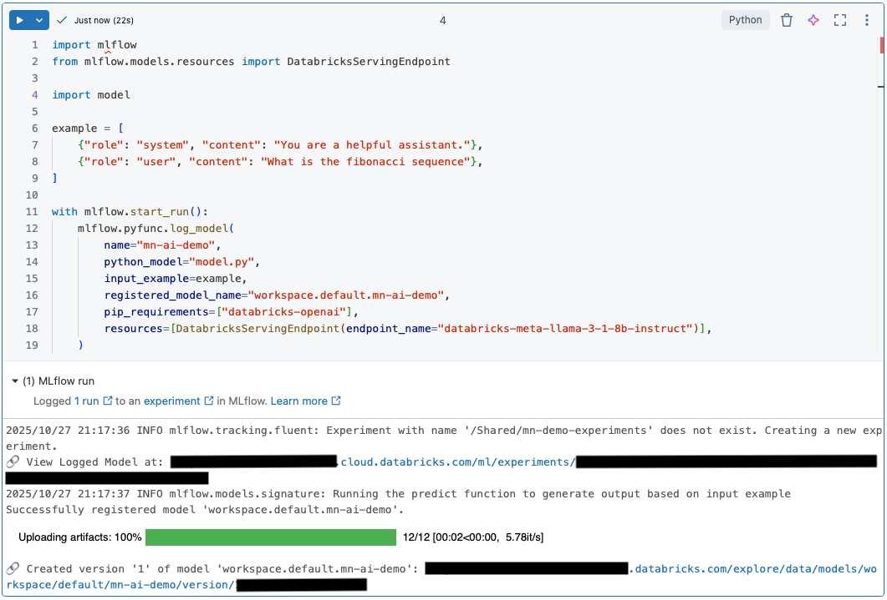

Databricks Mosaic AI Gateway helps teams manage and govern how they use LLMs and AI agents. Out of the box, it includes features like permission and rate limiting, payload logging, usage tracking, AI guardrails, fallbacks, and traffic splitting. These tools give teams tighter control over their AI workloads, making it easier to manage access, monitor performance, and keep costs in check.

Although Mosaic AI Gateway comes with many powerful features, one capability does not come without a little effort: MLflow Tracing. Tracing is like logging with context — it doesn’t just capture the request and response, but also the intermediate steps that reveal what happened inside your AI system when something goes wrong. As you’ll see, MLflow traces can be an invaluable tool when debugging or optimizing an LLM workflow.

So the question becomes: **how do you build a Mosaic AI Gateway endpoint that captures traces for each request?**

## Why this guide?

If you’ve explored the newer Databricks AI features, you’ve probably bounced between docs for Databricks, MLflow, and OpenAI. The information is there, but connecting it into a working, trace-enabled endpoint can feel like stitching three manuals together.

I spent the past month doing exactly that — configuring endpoints, testing integrations, and figuring out what actually works in practice. This post distills those lessons into a concrete, end-to-end setup you can adapt quickly. It’s a practical guide to getting tracing working with Mosaic AI Gateway - the kind I wish I'd had when I started. 

To save you time, I’ll start by showing the solution up front, then walk you through through the paths that didn’t pan out so you understand the trade-offs.

## The Solution: `ResponsesAgent`

As promised, let’s start with the answer.

The simplest way to enable tracing while maintaining access to the features of Mosaic AI Gateway is to create and deploy a **ResponsesAgent** model in Databricks. This model type has MLflow Tracing enabled by default, and when hosted through the Gateway, you retain the same production capabilities (including rate limiting, logging, guardrails, and more).

In short, this model gives you the best of both worlds: full Gateway functionality and detailed trace data for every request.

If you’re here just for the implementation, you can skip to the section on [ResponsesAgent](#attempt-3-responses-agent). But if you’re curious how I arrived at this solution, stick around, as the next sections cover the other approaches I tried, the dead ends I hit, and how they led me to this path.

## Attempt 1: Foundation Models

Like anyone learning a new system, I started at the beginning, the [Mosaic AI Gateway Introduction](https://learn.microsoft.com/en-us/azure/databricks/ai-gateway/) page. It includes a table showing which features each model type supports:


At first glance, **external model endpoints** seemed the most capable. However, for this walkthrough, I focused on **foundation models**. They’re easier for readers to follow since they don’t require setting up authentication or external service access. Aside from that, foundation and external models behave almost identically in configuration, serving, and Gateway features.

As a newcomer, I assumed I could host a foundation model and get tracing automatically. My first goal was to spin up an endpoint to see if this was possible.

### Creating a Foundational Model Endpoint

When creating infrastructure in Databricks, there are usually multiple paths to the same result — Terraform, Python, SQL, or the UI. For investigative work like this, I prefer the UI. It makes it easy to explore configurations and verify behavior visually, even though in production you’d typically automate the process.

To create an endpoint, go to **Serving → Create Serving Endpoint**, then choose **Foundation Models** in the *Served Entities* section. This opens the endpoint creation menu shown below. Working through it from top to bottom, first give your endpoint a name, then configure the *Served Entities* section.


Click **Select an Entity**, choose **Foundation Models** from the radio list, then click **Select a foundation model** in the box. You'll see a new pop-up menu listing both foundation and external models.


This can be confusing at first because the pop-up menu is labeled Foundation Models, yet it also lists external providers. I’m calling this out for two reasons:

1. If you'd like to configure an **external model**, this is where you’ll configure authentication and provider settings. Take note of the endpoint name, as you’ll reference it later when setting up your ResponsesAgent.
2. It highlights how similar these two endpoint types really are. Authentication is the only major difference; otherwise, the setup flow is nearly identical.

Once you’ve chosen a foundation model (in this case, I selected **GPT OSS 20B** for the foundation model endpoint demo, though I use a different model in the code examples later), you’ll see the configuration screen below.


You can set throughput and scaling options here — but notice what’s missing: **there’s no tracing toggle**.

> **Note**: When I first started, I saw some models with a tracing toggle in the UI, but those have since disappeared. Databricks evolves quickly, and feature changes often land mid-project. When I began this post, I expected to ask, “What if your model doesn’t support tracing?” Now none of them do, but fortunately I still have an answer.

### Searching for the Missing Piece

Without a clear tracing option, I turned to the docs. There’s plenty of material on tracing GenAI apps, but not much on creating an **endpoint** that automatically traces each request.

A few helpful but incomplete resources included:

- ["Get started: MLflow Tracing for GenAI (Databricks Notebook)"](https://learn.microsoft.com/en-us/azure/databricks/mlflow3/genai/getting-started/tracing/tracing-notebook) — great for learning how traces work, but only covers tracing single notebook requests.
- ["Tracing OpenAI"](https://learn.microsoft.com/en-us/azure/databricks/mlflow3/genai/tracing/integrations/openai) — shows how to trace OpenAI calls, but not for endpoint deployment.

As you'll find if you start to go through the docs as well, most examples show how to trace one request from a notebook, not how to create an endpoint creates a trace for each request it receives. Eventually, I found ["Deploy agents with tracing"](https://learn.microsoft.com/en-us/azure/databricks/mlflow3/genai/tracing/prod-tracing), which pointed me in the right direction.

I was skeptical of the ResponsesAgents at first. Initially, I thought *Why would I need an agent for something this simple*? But that article sparked an idea — what if I created a **wrapper model** that calls the underlying model and handles tracing automatically? That became the seed for my next experiment.

## Attempt 2: Custom Python Model

If foundation models couldn’t generate traces directly, then I needed something that could. The solution was a wrapper model, a lightweight layer that receives a request, forwards it to the underlying model, and returns the response unchanged. The difference is that the wrapper can be configured to add tracing to each request by default.

Here's the plan:

1. Build a small model class that wraps around our foundation model.
2. Configure the class so that tracing is enabled by default.
3. Register the model in Unity Catalog.
4. Deploy it as a Serving Endpoint, with full AI Gateway functionality and tracing.

This approach gives you the same Gateway functionality as before, but with complete trace coverage. If this sounds confusing, hopefully the code examples will help make things concrete.

### Wrapper Options

Once I knew I needed a wrapper, the question became: *how should I define it in MLflow*? There were two clear paths:

- **Custom Python Model** — Define your own the `PythonModel` class and implement your own prediction functions.
- **Responses Agent Model** — Use the `ResponsesAgent` class to create a agent model that calls your foundation model under the hood.

As I mentioned before, I had my doubts about ResponsesAgents so I decided to start with the **Custom Python Model**. My goal wasn’t to build a full agent-based system, I just wanted to trace model calls. That made the **Custom Python Model** path seem like the most straightforward solution.

That said, the [Gen AI Apps guide](https://learn.microsoft.com/en-us/azure/databricks/generative-ai/guide/introduction-generative-ai-apps) clearly recommends using response agents over custom python models. However, I still wasn't convinced. 

So I built the Python model — and, as you can probably guess, it worked, but not as well as I’d hoped. Once it was running, I compared it to a `ResponsesAgent` implementation and found that the agent approach was cleaner, better aligned with the newer OpenAI Responses API, and more future-proof as the platform continues to evolve.

### Implementing a Custom Python Model

To create a custom model in MLflow, you define a class that inherits from `mlflow.pyfunc.PythonModel`. The key method is `predict()`, which receives input and returns output. In our case, it simply forwards each request to a foundation model and returns the response, acting as a transparent wrapper.

If you’d like to dig deeper, these are the main references I used:

- [MLflow Python Model Guide](https://mlflow.org/docs/latest/ml/model/python_model/)
- [Custom Serving Applications](https://mlflow.org/docs/latest/genai/serving/custom-apps/)
- [MLflow Python Model Class](https://mlflow.org/docs/latest/api_reference/python_api/mlflow.pyfunc.html#mlflow.pyfunc.PythonModel)

**1. Install dependencies**

In the first notebook cell, install the following libraries using the code below:

```python
%pip install -U -qqqq databricks-openai
dbutils.library.restartPython()
```

In addition to installing the `databricks-openai` package, this command upgrades MLflow. At the time of writing, the serverless compute option has `mlflow-skinny` 2.x installed, but the tracing code below requires MLflow 3.x.

| Default Libraries            | Installed Libraries             |
|------------------------------|---------------------------------|
| `mlflow-skinny==2.21.3`      | `mlflow==3.4.0`                 |
| `databricks-connect==16.4.2` | `mlflow-skinny==3.4.0`          |
| `databricks-sdk==0.49.0`     | `mlflow-tracing==3.4.0`         |
|                              | `databricks-ai-bridge==0.8.0`   |
|                              | `databricks-connect==16.4.2`    |
|                              | `databricks-openai==0.6.1`      |
|                              | `databricks-sdk==0.49.0`        |
|                              | `databricks_vectorsearch==0.59` |

> ⚠️ Note: MLflow’s documentation warns against installing both `mlflow` and `mlflow-skinny`. I haven’t encountered any issues, and several Databricks examples use the same approach. Still, it’s worth keeping in mind if anything behaves unexpectedly.

**2. Define your model**

In cell 2 of our notebook, we define our model and save it to `model.py`. Let’s walk through the code from top to bottom to better understand it.

```python
%%writefile model.py
import mlflow
from mlflow.pyfunc import PythonModel, PythonModelContext
from databricks.sdk import WorkspaceClient
from typing import Any, Dict, List, Optional


class ModelWrapper(PythonModel):
    def __init__(self):
        self.client = WorkspaceClient().serving_endpoints.get_open_ai_client()

    def predict(
        self,
        context: PythonModelContext,
        model_input: List[Dict[str, str]],
        params: Optional[Dict[str, Any]] = None,
    ) -> List[str]:
        results = []

        response = self.client.chat.completions.create(
            model="databricks-meta-llama-3-1-8b-instruct", messages=model_input
        )
        results.append(response.choices[0].message.content)

        return results

mlflow.openai.autolog()
mlflow.set_tracking_uri("databricks")
mlflow.set_experiment("/Shared/mn-demo-experiments")
mlflow.models.set_model(ModelWrapper())
```

The `%%writefile` command writes this cell’s contents to the `model.py` file. This is required because the model registration step needs to read in the model from a Python file. We could have placed this code in the file manually and omited this cell from the notebook. However, the `%%writefile` command allows us to keep all the code self-contained within a single notebook.

The `ModelWrapper` class inherits from `PythonModel`, the standard interface for custom MLflow models. Inside the constructor, we initialize a `WorkspaceClient`, which handles communication with existing serving endpoints. This client lets the wrapper forward requests to either a foundation model or an external endpoint already registered in Databricks.

At this point, if you’d like to connect to an **external model** instead of a foundation model, follow these steps below:

1. Follow the steps in Attempt 1 to create a serving endpoint for your external model (e.g., `external-model-endpoint`).
2. Replace the `model` parameter in the `chat.completions.create()` call with the name of your external model.

The `predict()` method defines the inference logic — sending the request to the model and returning its response. You’ll notice that type hints are included for all parameters. MLflow specifically requires a type hint for the `model_input`
argument; without it, you’ll get a `UserWarning` when interacting with the model. Technically, only the `model_input` parameter needs an annotation to silence the warning. However, I prefer to be consistent and add type hints for every parameter and the return value. This not only prevents the warning but also keeps the code clean, readable, and aligned with Python best practices.

Finally, look closely at the last four lines of code; they’re easy to overlook but absolutely essential. These statements enable both **tracing and logging** within Databricks:

```python
mlflow.openai.autolog()
mlflow.set_tracking_uri("databricks")
mlflow.set_experiment("/Shared/mn-demo-experiments")
mlflow.models.set_model(ModelWrapper())
```

These lines enable tracing and logging.
- `mlflow.openai.autolog()` enables detailed trace collection. Without it, you’d only get partial trace data through manually placed decorators.
- `set_tracking_uri()` and `set_experiment()` specify where to store traces Databricks. If you skip this step, traces will only appear when you call the endpoint interactively from a Databricks notebook — not when hitting it via API.
- `set_model()` sets the model object that is going to be logged.

**3. Restart the Python Library**

This next step might seem odd, but it’s crucial. After creating `model.py`, restart the Python environment:

```python
dbutils.library.restartPython()
```

If you skip this step, you’ll likely run into an import error the first time you reference `model.py`. Databricks snapshots your working directory when the session starts, and since the `model.py` file didn’t exist at that time, the environment won’t recognize it until you restart. Restarting refreshes the session so the new file becomes visible.

The same issue applies if you modify `model.py` later. If you rerun the `%%writefile` cell to overwrite the file with new code, Databricks will continue to use the old version unless you restart the library again. It’s an easy mistake to make, and if you notice that your updates aren’t showing up, this is probably why.

**4. Register the model**

Once your `model.py` file is defined, the next step is to **register it in Unity Catalog**.

```python
import mlflow
from mlflow.models.resources import DatabricksServingEndpoint

import model

example = [
    {"role": "system", "content": "You are a helpful assistant."},
    {"role": "user", "content": "What is the fibonacci sequence"},
]

with mlflow.start_run():
    mlflow.pyfunc.log_model(
        name="mn-ai-demo",
        python_model="model.py",
        input_example=example,
        registered_model_name="workspace.default.mn-ai-demo",
        pip_requirements=["databricks-openai"],
        resources=[DatabricksServingEndpoint(endpoint_name="databricks-meta-llama-3-1-8b-instruct")],
    )
```

Since the previous `%%writefile` cell only wrote your model code to disk rather than executing it, you’ll need to re-import MLflow (and any dependencies) here. 

> ⚠️ Important: Don’t skip the `import model` line.
> 
> When Python imports the `model` module, it automatically runs the setup lines defined earlier (`autolog`, `set_tracking_uri`, `set_experiment`, and `set_model`).
> 
> This ensures your experiment configuration runs **before** `mlflow.start_run()` is called, properly linking traces to the correct experiment.
> 
> If you omit the import, MLflow will create two separate experiments, one under `/Shared` (as intended) and another tied to your notebook. Only one will contain trace data, leading to confusion and cleanup headaches later.

You might wonder why those setup lines live inside `model.py` file instead of the registration cell. I tried moving them into the registration cell, before the `start_run()` call. Unfortunately, the tracing functionality did not work correctly anymore. It appears MLflow requires those configuration calls to exist in the same file that defines the model so it can correctly attach the tracing context. 

If you’ve seen Databricks examples that omit the `import model` step, it’s usually because they test the model earlier in the notebook by importing it and calling its `predict()` method directly. In those cases, the setup lines run implicitly through statements like `from model import AGENT` or `from model import CustomPythonModel`. It's important to understand that if you skip that test cell, you’ll need to explicitly import your Python model as shown here — otherwise you’ll end up with duplicate experiments and inconsistent logs. It’s a small but important detail that saves a lot of confusion later on.

Finally, the `example` variable defines a minimal input payload that MLflow uses to validate your model during registration.

**What to Expect When You Run Model Registration Code**

When you execute the registration cell, MLflow confirms that the run completed successfully and that a new model version and experiment location were created. During this process, you’ll see a message like *“Running the predict function to generate output based on input example.”* This step validates your model end to end by running a quick inference with the `example` input you defined earlier.



Unfortunately, **no trace is logged when you register a custom Python model**.

Interestingly, if you forget to include the `import model` line — the same mistake I mentioned earlier that creates two experiment locations — the *secondary* experiment tied to your notebook will record a trace for the input example. In this case, you’ll also see the model’s output appear inline in the notebook cell.

However, when you add the `import model` line back (which is the correct setup), the trace and inline output disappear. I’m not sure why this happens, but it seems to be a limitation of the **PythonModel** implementation. The **ResponsesAgent**, by contrast, does log a trace for the input example, so this behavior appears unique to custom Python models.

Even so, the validation step during registration is still useful. If your input example contains an error, Databricks will catch it and report the issue before completing the run.

In the short video below, I demonstrate two ways to invoke your model. The first uses `mlflow.pyfunc.load_model()`, and the second imports it directly. In both cases, a trace appears in the notebook output. After the `predict()` call completes, I navigate to the **Experiments** page to confirm the results. You should see a new experiment under the path specified in your setup (in my case, `/Shared/mn-demo-experiments`, as defined in the `mlflow.set_experiment()` call inside `model.py`).

<div class="video-wrapper">
    <video controls playsinline>
        <source src="first-trace-demo.mp4" type="video/mp4">
        Your browser does not support the video tag.
    </video>
</div>

As you can see in the video, the resulting trace contains much more than just the input prompt and model response. It includes structured metadata about the request, timestamps, token usage, model configuration, and more. These details are what make MLflow Tracing so valuable when debugging or tuning model behavior.

### Creating the Endpoint

With your model now registered in Unity Catalog, the next step is to deploy it as a **serving endpoint**. Navigate to the endpoint creation page, just as we did in Part 1 of this guide. Then select your newly registered Python model from the list — you should now see an option to enable tracing. Make sure this setting is turned on if it isn’t already.


Scroll down to the **AI Gateway** section to configure additional settings like the **Inference Table**, which records all requests and responses. This table is useful for auditing and performance tracking, though it doesn’t include the same level of detail as MLflow Traces. (Keep in mind that inference tables aren’t available on the free Databricks tier.)

Once you’ve configured your settings, click **Create** and wait for deployment to finish. When the status changes to **Active**, your endpoint is live and ready for API calls.


You can now test it with `curl` or your favorite REST client (I like the REST Client extension in VS Code). After sending a few requests, open the **Experiments** page under your shared experiment path to see fresh traces appear. Here’s a quick demo showing the process:

<div class="video-wrapper">
    <video controls playsinline>
        <source src="rest-demo-redone.mp4" type="video/mp4">
        Your browser does not support the video tag.
    </video>
</div>

> **Note**: If the trace in the video looks unusual, don’t worry. It might be because the free edition of Databricks isn’t configured with the same feature set as the full platform. I’ve encountered this before, and it resolved itself without any code changes, which suggests it’s a platform-level issue. Even if the trace appears odd, the key point is that it was logged successfully.

At this point, you’ve successfully built an endpoint with full Mosaic AI Gateway functionality and detailed tracing — all through a custom Python model. You might be wondering why I’m not recommending this approach. The issue is that I had trouble getting streaming responses to work reliably with the custom model. If streaming had worked seamlessly, this might have been my final recommendation.

### What Went Wrong with Streaming Requests

If you’ve explored the MLflow documentation I referenced earlier, you may have noticed that the `PythonModel` class also defines a `predict_stream()` method. By overriding it, you can support **streaming requests**, letting your model return partial results as they arrive.

Here’s the basic idea: when a REST request includes a streaming parameter, MLflow calls `predict_stream()` instead of `predict()`. Here’s how I first implemented it inside the `ModelWrapper` class:

```python
def predict_stream(
        self,
        context: PythonModelContext,
        model_input: List[Dict[str, str]],
        params: Optional[Dict[str, Any]] = None,
    ) -> Iterator[str]:
        response = self.client.chat.completions.create(
            model="databricks-meta-llama-3-1-8b-instruct",
            messages=model_input,
            stream=True,
        )

        full_message = ""
        for chunk in response:
            if chunk.choices and chunk.choices[0].delta.content:
                new_content = chunk.choices[0].delta.content
                full_message += new_content
                yield new_content

        yield full_message
```

**Testing in a Notebook**

When I imported the module directly in a Databricks notebook and invoked `predict_stream()` manually, everything worked perfectly. Responses streamed back in real time, and each run produced a complete MLflow trace showing every chunk of output. The trace even captured each piece of information emitted by the model, token by token. At the end of the run, I navigated to the **Events** section to show each chunk in sequence.

<div class="video-wrapper">
    <video controls playsinline>
        <source src="python-streaming.mp4" type="video/mp4">
        Your browser does not support the video tag.
    </video>
</div>

This confirmed that the function worked correctly when called directly. I could see each token arriving in sequence, and tracing behaved exactly as expected.

Encouraged, I tried the same workflow through other access methods. That’s when things started to break.

**Testing Through the Loaded Model and REST API**

After registering the model in Unity Catalog, I loaded it with `mlflow.pyfunc.load_model()` and called `predict_stream()` again. This time, it failed.


Interestingly, the regular `predict()` method still worked when invoked with the procedure shown above - only streaming failed. Invoking the `predict_stream()` function via the REST API did not work either.

At this point, I was puzzled. The function worked perfectly in one context but failed in another. I briefly considered adding a streaming flag to the `predict()` method itself (e.g., `predict(streaming=True)`), but that felt like a workaround — not how the MLflow API was meant to be used. I wanted to understand why `predict_stream()` behaved inconsistently.

**Digging into the Cause**

Why didn’t `predict_stream()` work when the model was loaded from Unity Catalog?

The key detail lies in what `mlflow.pyfunc.load_model()` actually returns. According to the [MLflow docs](https://mlflow.org/docs/latest/api_reference/python_api/mlflow.pyfunc.html#mlflow.pyfunc.load_model), it doesn’t return your `PythonModel` directly — it returns a `PyFuncModel`, a wrapper class that standardizes how models are called.

When you invoke `predict_stream()` on the loaded model, you’re actually calling the wrapper’s version of that function, which then delegates to your implementation. Unfortunately, something in that handoff, specifically in how inputs are validated and passed through, seems incompatible with the OpenAI-style message list I was using.

For anyone interested in exploring further, you can inspect the `predict_stream` implementation in the [PyFuncModel source code](https://mlflow.org/docs/latest/api_reference/_modules/mlflow/pyfunc.html). 

What frustrated me about this experience is that [PythonModel documentation](https://mlflow.org/docs/latest/api_reference/python_api/mlflow.pyfunc.html#mlflow.pyfunc.PythonModel) states that both `predict()` and `predict_stream()` accept PyFunc-compatible input. Since my input worked perfectly with `predict()`, I expected it to work with `predict_stream()` as well. The [Inference API docs](https://mlflow.org/docs/latest/api_reference/python_api/mlflow.pyfunc.html#pyfunc-inference-api) even note that “a list of any type” should be valid input, further suggesting this should have worked.

**Where Things Stand**

To make `predict_stream()` work, I had two main options:

1. Change its input format to something that MLflow’s wrapper would accept, or
2. Modify `predict()` to handle streaming requests as well.

Both felt like poor tradeoffs. I didn’t want to maintain separate input schemas for `predict()` and `predict_stream()`, and adding a “streaming” flag to `predict()` just to make it behave differently seemed inelegant.

So while the custom Python model approach worked beautifully for **standard requests**, giving full control, transparency, and seamless Databricks integration, it simply wasn’t reliable for **streaming**. For many use cases, that limitation might not matter. But for my goal — supporting both standard and streaming completions — it was a dealbreaker.

So it was time to move on to **Attempt 3: the ResponsesAgent**.

## Attempt 3: Responses Agent

Databricks provides a “simple” guide for creating a Responses Agent endpoint. It’s a good starting point, but I’ll admit, I wasn’t a huge fan of the sample notebook. The call stack for basic predictions felt unnecessarily complex, and several unused libraries made it tough to tell which parts actually mattered. 

That said, the example still illustrates the core concept well. I adapted it into a cleaner, minimal version that focuses on the essentials, which we’ll walk through here.

For anyone curious, you can find Databricks’ original example notebook here: https://docs.databricks.com/aws/en/notebooks/source/mlflow3/simple-agent-mlflow3.html.

### Implementing a Responses Agent

As before, we’ll start our notebook with an installation cell — but this time we’ll add the `databricks-agents` library alongside `databricks-openai`. Following the installation cell, we have the `%%writefile` cell which writes our code to the `model.py` file. 

> Note: In Databricks, `.py` files can be loaded as notebooks. Cells are separated by lines containing `# COMMAND ----------`, so the following code block represents two notebook cells.

```python
%pip install -U -qqqq databricks-openai databricks-agents
dbutils.library.restartPython()

# COMMAND ----------

%%writefile model.py
import mlflow

from mlflow.pyfunc import ResponsesAgent
from mlflow.types.responses import (
    ResponsesAgentRequest,
    ResponsesAgentResponse,
    ResponsesAgentStreamEvent,
)

from databricks.sdk import WorkspaceClient

from typing import Generator


class SimpleResponsesAgent(ResponsesAgent):

    def __init__(self):
        self.workspace_client = WorkspaceClient()
        self.client = self.workspace_client.serving_endpoints.get_open_ai_client()
        self.model = "databricks-meta-llama-3-1-8b-instruct"

    def predict(self, request: ResponsesAgentRequest) -> ResponsesAgentResponse:
        messages = request.input

        response = self.client.chat.completions.create(
            model=self.model,
            messages=self.prep_msgs_for_cc_llm(messages),
        )

        return ResponsesAgentResponse(
            output=[
                self.create_text_output_item(
                    text=response.choices[0].message.content, id=response.id
                )
            ],
        )

    def predict_stream(
        self, request: ResponsesAgentRequest
    ) -> Generator[ResponsesAgentStreamEvent, None, None]:
        response = self.client.chat.completions.create(
            model=self.model,
            messages=self.prep_msgs_for_cc_llm(request.input),
            stream=True,
        )

        item_id = 1
        full_message = ""
        for chunk in response:
            if chunk.choices and chunk.choices[0].delta.content:
                new_content = chunk.choices[0].delta.content
                full_message += new_content
                yield ResponsesAgentStreamEvent(
                    **self.create_text_delta(
                        delta=new_content, item_id=f"msg_{item_id}"
                    ),
                )
                item_id += 1

        yield ResponsesAgentStreamEvent(
            type="response.output_item.done",
            item=self.create_text_output_item(
                text=full_message,
                id=f"msg_{item_id-1}",
            ),
        )

        return


mlflow.openai.autolog()
mlflow.set_tracking_uri("databricks")
mlflow.set_experiment("/Shared/mn-demo-experiments-agent")
mlflow.models.set_model(SimpleResponsesAgent())
```

**Understanding the `predict()` Function**

At first glance, this looks similar to our earlier custom Python model, but there are three key differences:

1. **Inheritance**: our class now inherits from `ResponsesAgent` instead of `PythonModel`.

2. **Types**: `predict()` accepts a single parameter of type `ResponsesAgentRequest` and returns a `ResponsesAgentResponse`.

3. **Translation**: before sending messages to the model, it calls `self.prep_msgs_for_cc_llm()` — a helper function that quietly handles a lot of complexity.

In order to understand these differences and fully understand the code, we have to start at the **request and response structures** in place.

**Request and Response Structure**

Here's a simplified example from the [MLflow Responses Agent docs](https://mlflow.org/docs/latest/genai/serving/responses-agent/#schema-and-types).   

```python
# Example Request schema
{
    "input": [
        {
            "role": "user",
            "content": "What is the weather like in Boston today?",
        }
    ],
    "tools": [
        {
            "type": "function",
            "name": "get_current_weather",
            "parameters": {
                "type": "object",
                "properties": {"location": {"type": "string"}},
                "required": ["location", "unit"],
            },
        }
    ],
}

# Example Response schema
{
    "output": [
        {
            "type": "message",
            "id": "some-id",
            "status": "completed",
            "role": "assistant",
            "content": [
                {
                    "type": "output_text",
                    "text": "rainy",
                }
            ],
        }
    ],
}
```

These schemas define how `ResponsesAgentRequest` and `ResponsesAgentResponse` are structured.  Both can include additional parameters (like temperature or max_output_tokens), so it’s worth checking the [full API reference](https://mlflow.org/docs/latest/api_reference/python_api/mlflow.types.html#mlflow.types.responses.ResponsesAgentRequest) for details.

**The Role of `prep_msgs_for_cc_llm()`**

OpenAI recently introduced a new **Responses API** to improve upon their existing **Chat Completions API**. Databricks’ `ResponsesAgent` class and its request/response types are built to align with this newer API. However, the two APIs expect slightly different input formats.

- **Chat Completions API**: expects a list of messages.
- **Responses API**: accepts a single string or a structured schema.

As a result, a request formatted for the Responses API won’t necessarily work with the Chat Completions API. That’s where the `prep_msgs_for_cc_llm()` (short for "prepare messages for chat completion LLM") comes in. It automatically converts input from the Responses format to the Chat Completions format. Fortunately, you don’t have to define it yourself; it’s inherited from the ResponsesAgent base class.

**Why Not Use the Responses API Directly?**

It’s a fair question: if our input already matches the Responses schema, why not call the Responses API itself? Something like this should, in theory, work:

```python
messages = request.input

response = client.responses.create(
    model=self.model,
    messages=messages,
)
```

In theory, yes — but in practice, not yet within Databricks. The `WorkspaceClient` from the Databricks SDK provides a client that can access registered models inside your workspace, regardless of where they’re hosted. It’s convenient because you don’t need to configure environment variables for authentication.

My guess is that this SDK client hasn’t been fully updated to support the new Responses API. As a result, calling client.`responses.create()` currently raises an error, even with simple requests. This theory is further supported by the official Databricks notebooks: all of them use the `ResponsesAgent` class (which matches the Responses API schema) but still call the Chat Completions API using the `prep_msgs_for_cc_llm` function behind the scenes.

**A Note on Alternative Clients**

You *can* call the Responses API in Databricks using the standard OpenAI client instead of the SDK:

```python
from openai import OpenAI

client = OpenAI()
```

This approach works for external models that support the Responses API (though some older models don’t). However, it requires manual environment variable setup for authentication and access to an external model. For this guide, I chose to stay within Databricks’ built-in foundation models to keep things simpler.

**Wrapping Up `predict()`**

Once the messages are translated, the model call proceeds as usual. The last step is to return a response object that conforms to the `ResponsesAgentResponse` schema:

```python
        return ResponsesAgentResponse(
            output=[
                self.create_text_output_item(
                    text=response.choices[0].message.content, id="msg_1"
                )
            ],
        )
```

This ensures the output follows the expected Responses schema, even though the underlying model call still uses the Chat Completions API. The `create_text_output_item()` helper builds a properly structured entry, one of several output types available. You can explore the full list in the [ResponsesAgent documentation](https://mlflow.org/docs/latest/genai/serving/responses-agent/#creating-agent-output).

Don’t worry about losing response details here. Even though we return only the generated text, MLflow’s tracing automatically records the full request, response, and metadata — giving you complete visibility into each call.

**What About Streaming?**

Streaming worked much more smoothly with `ResponsesAgent` than it did with the custom Python model.

Here’s what’s happening in the code:

1. The call to the model includes the `stream=True`, which signals that we want token-by-token output.
2. The response arrives in chunks. The code accumulates these chunks into a single message.
3. As new chunks arrive, we yield incremental `ResponsesAgentStreamEvent` objects, letting the user see updates in real time.
4. Finally, we yield a “done” event to signal completion.

This design allows your application to display streaming responses without blocking — and since it’s built into the `ResponsesAgent` framework, the setup is minimal.

**Logging and Deployment**

There are three additional notebook cells to complete the setup:

```python
dbutils.library.restartPython()

# COMMAND ----------

import mlflow
from mlflow.types.responses import ResponsesAgentRequest
from mlflow.models.resources import DatabricksServingEndpoint

import model

UC_LOCATION = f"workspace.default.mn-ai-agent-demo"

example = [
    {"role": "system", "content": "You are a helpful assistant."},
    {"role": "user", "content": "What is the fibonacci sequence"},
]

with mlflow.start_run():
    logged_agent_info = mlflow.pyfunc.log_model(
        name="mn-ai-agent-demo",
        python_model="model.py",
        input_example=ResponsesAgentRequest(input=example),
        registered_model_name=UC_LOCATION,
        pip_requirements=["databricks-openai"],
        resources=[DatabricksServingEndpoint(endpoint_name="databricks-meta-llama-3-1-8b-instruct")],
    )

# COMMAND ----------

from databricks import agents

agents.deploy(
    UC_LOCATION,
    model_version=logged_agent_info.registered_model_version,
)
```

The first cell restarts the Python library (just as we did for the custom Python model) to ensure the environment picks up any new dependencies. The second cell logs the model, a familiar step from earlier attempts, and the third cell deploys the agent directly from code. With the `ResponsesAgent`, there’s no need to open the Databricks Serving UI manually. If the model is already deployed, the same command simply updates it in place. It's a small but welcome touch that makes iteration noticeably faster.

**Agent Demo**

Up to this point, most of the examples have focused on querying the `predict()` function in the custom Python model. What I haven’t shown yet is how to query and test the ResponsesAgent model.

The code isn’t substantially different from the Python model, so there’s no need to go through it line by line again. However, it’s worth demonstrating that the `ResponsesAgent` performs just as well — and, importantly, handles streaming far more smoothly.

In the short video below, I’ll walk through the full workflow from start to finish. You’ll see the model registration and deployment steps, followed by the **input example used during model validation**, which this time is fully traced (unlike in the Python model, where validation traces weren’t captured). Finally, I’ll invoke the model directly from a notebook, calling both the `predict()` and `predict_stream()` functions. You’ll see the associated traces appear in the notebook output, and then I’ll navigate to the **Experiments** page to confirm they were logged correctly. In the **Experiments** page, you'll see three traces in total - one for the validation example, another for the `predict()` call, and the third for the `predict_stream()` call.

I won’t demonstrate the REST endpoint here — there’s no meaningful difference from the Python model example. The main thing to pay attention to is the `predict_stream()` function, which now works seamlessly with the `ResponsesAgent` where it previously failed in the custom Python model.

<div class="video-wrapper">
    <video controls playsinline>
        <source src="responses-agent-demo.mp4" type="video/mp4">
        Your browser does not support the video tag.
    </video>
</div>

> **Note**: In the video, some cell outputs were intentionally hidden to conceal the URL where the agent is being deployed. You’ll have to take my word and the green check marks that everything worked as expected. I’d love to say I figured out how to properly redact those values in the video, but I’m not quite that tech-savvy (yet). Maybe that’ll be the topic of a future blog post.

## Conclusion

It was a long journey to arrive at the **Responses Agent** approach, but hopefully one that made the reasoning clear.

If you’ve followed along from the beginning, you’ve seen how a newcomer might start with foundation models, experiment with custom Python models, and eventually discover that Responses Agents offer the most reliable, traceable path forward.

If you take away just a few things, let them be these:

You now understand how **Mosaic AI Gateway**, model serving, Python models, and Responses Agents fit together.

And if you’re building something similar, you can confidently start with **Responses Agents**, knowing the alternatives have been explored and tested.

Thanks for reading, and for sticking with such a deep-dive post. My goal was to make this guide as thorough as possible, answering the same questions I had when I first started.

If you found this helpful, stay tuned for more articles on **data engineering, AI, and Databricks** — there’s plenty more to explore.
