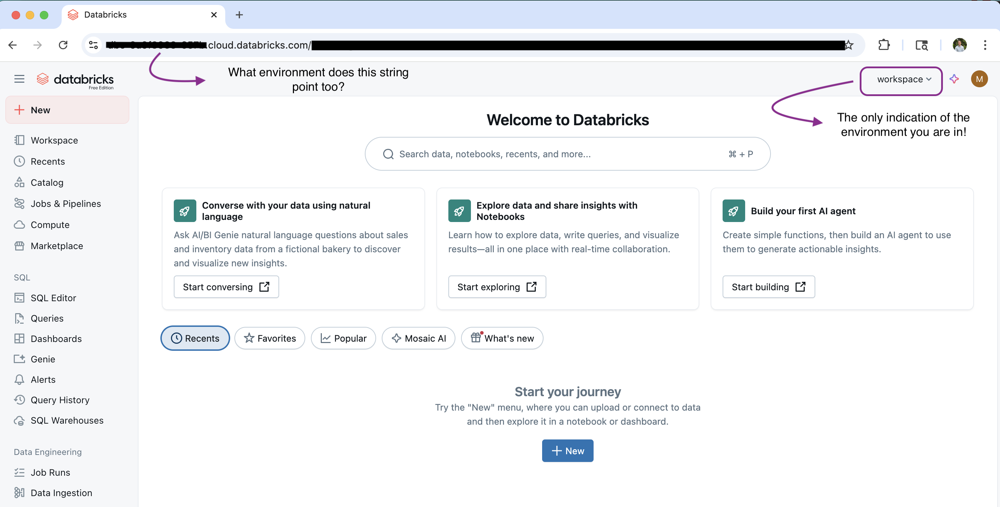

Databricks is quickly becoming one of the most popular data lakehouse platforms out there. Its popularity is growing fast, and for many developers, a significant portion of the job happens directly in the browser inside their Databricks workspace.  

Yes, I know—there are popular extensions that let you develop code outside of Databricks. Many folks swear by the VS Code extension because they prefer working in their favorite editor. But at the end of the day, you’re still going to spend time in the browser making sure your code runs as expected.  

👉 If you’d rather skip ahead and get straight to the solution, I’ve published the script (with setup instructions) in this [GitHub repo](https://github.com/mnorberg-dev/databricks-tools).

## The Problem: Too Many Tabs, Too Few Clues

Many organizations using Databricks have multiple workspaces to represent different environments—think `dev`, `qa`, and `prod`. Some even have additional splits like staging or sandbox.  

If you’re working across all of them, here’s the problem: **your browser tabs all look the same.**  


> Note: URLs in images are redacted, but in your environment, the redacted portions will appear as GUIDs.

Inside the workspace, the situation isn’t much better. It's not easy to determine which environment you are in. Technically, each environment does identify itself in two places though:  

1. **The domain name.** Every environment has a URL like `adb-<long string of numbers>`. But let’s be honest—nobody remembers arbitrary GUIDs. It’s the same reason DNS exists: humans prefer names like `google.com` instead of memorizing IP addresses.  
2. **A small piece of text in the top-right corner.** Sure, it’s there, but after seeing it hundreds of times, your brain starts ignoring it. It’s easy to miss, and if you’re juggling multiple tabs, you can’t even see that text without clicking into each one.

The end result? Confusion, context-switching, and the very real risk of running a query in `prod` that you meant for `dev`.  



## But Wait, Isn’t There a Color Trick?

Some people solve this by assigning different themes—say, dark mode for `prod` and light mode for `dev`. Clever idea, but it falls apart quickly:  

- There are only two color schemes available and many organizations have three workspaces meaning one environment will inevitably match another.
- If two or more environments share a metastore, changing one changes the other.  
- And let’s be honest: some developers simply refuse to use a theme they don’t like.  

So while the color trick can work in a pinch, it’s not a real solution.  


> To activate dark mode, navigate to Settings → User Preferences → “Prefer Dark.”  
>     
> If you don’t enable this setting, your environment theme will default to match the light theme shown in the images above.  

## The Solution: Tampermonkey to the Rescue  

Enter **Tampermonkey**, a browser extension that lets you run custom JavaScript whenever you visit a matching URL.  

With a short script, you can automatically label your Databricks browser tabs with an emoji + text identifier for each environment. Suddenly, `dev`, `qa`, and `prod` are crystal clear.  

It’s simple, lightweight, and makes a huge difference:  
- Faster navigation between environments  
- Reduced risk of editing the wrong workspace  
- A quality-of-life boost you’ll wonder how you lived without  

And best of all: **little to no performance impact**. I’ve been running this script for weeks, and my browser hasn’t skipped a beat.  Below, I've provided an image illustrating what your dev environment will look like after setting up the Tamper Monkey script for yourself.


## How to Set It Up

Getting your Databricks tabs labeled automatically is quick and easy. You’ll need to:  

1. Install Tampermonkey  
2. Create a new script  
3. Paste in the code  
4. Configure your environment domains  
5. Save and enable the script  
6. Enable user scripts in your browser (Chrome only)  
7. Verify it’s working  

> Note: These instructions are written for Google Chrome, but the steps can be adapted to other browsers that support Tampermonkey.

Follow the steps below.

### 1. Install Tampermonkey
- Download Tampermonkey for your browser from [tampermonkey.net](https://www.tampermonkey.net/).  
- Restart your browser after installation.

### 2. Create a New Script
- Open the Tampermonkey extension → Dashboard → “Create a new script.”  
- Delete the boilerplate code so the editor is blank.

### 3. Add the Script
Copy and paste the following code into the new script: 

```js
// ==UserScript==
// @name         Databricks Tab Emoji Label
// @namespace    http://tampermonkey.net/
// @version      1.5
// @description  Add emoji and label to Databricks tab title based on environment
// @author       Matthew Norberg
// @match        https://<your-domain-here>.azuredatabricks.net/*
// @grant        none
// ==/UserScript==

(function() {
    'use strict';

    function updateTitle() {
        const url = window.location.href;
        let label = '';
        let emoji = '';

        // Define your environment domains here
        let devDomain = '';
        let qaDomain = '';
        let prodDomain = '';

        if (url.includes(devDomain)) {
            label = 'DEV';
            emoji = '🟢';
        } else if (url.includes(qaDomain)) {
            label = 'QA';
            emoji = '🟡';
        } else if (url.includes(prodDomain)) {
            label = 'PROD';
            emoji = '🔴';
        } else {
            label = 'OTHER';
            emoji = '⚪';
        }

        if (!document.title.startsWith(`[${emoji} ${label}]`)) {
            document.title = `[${emoji} ${label}] ${document.title}`;
        }
    }

    // Initial run
    setTimeout(updateTitle, 3000);

    // Monitor for URL changes in SPA
    let lastUrl = location.href;
    new MutationObserver(() => {
        const currentUrl = location.href;
        if (currentUrl !== lastUrl) {
            lastUrl = currentUrl;
            setTimeout(updateTitle, 2000);
        }
    }).observe(document, {subtree: true, childList: true});

})();
```

### 4. Configure Environment Domains

Near the top of the script, replace the placeholders with your actual environment domains:

```js
let devDomain = 'your-dev-domain';
let qaDomain = 'your-qa-domain';
let prodDomain = 'your-prod-domain';
```

### 5. Save and Enable the Script

- Save your changes (File → Save).

- Make sure the script toggle in Tampermonkey is turned on (green).

### 6. Enable User Scripts in Chrome

- Go to `chrome://extensions` → find Tampermonkey → click **Details**.

- Make sure **Allow user scripts** is enabled.

> Note: Other browsers may have different settings for allowing user scripts—adapt accordingly.

### 7. Verify installation

- Open your Databricks environment in a new tab.

- After a few seconds, your tab title should display the correct emoji + environment label.

## Troubleshooting

**Tab title doesn’t update right away**  
- The script intentionally waits **3 seconds** after page load before applying changes.  
- Without this delay, the title gets updated but is overwritten during the web page loading process.
- In testing, **3 seconds worked well**, but you can adjust this by editing the `setTimeout` call in the code:  

  ```js
  setTimeout(updateTitle, 3000);
  ```

**Still not working?**

Double-check that:

- The script is enabled in Tampermonkey.
- Your domains are correctly set in both the variables and the @match lines.
- “Allow user scripts” is enabled in your browser’s extension settings.

## Final Thoughts

It’s a small tweak, but it solves a surprisingly big problem. If you’re juggling multiple Databricks environments, this little script will save you from confusion—and maybe even prevent a mistake or two.

Sometimes the best tools aren’t the big, complicated ones. They’re the tiny hacks that make your day smoother.

👉 You can grab the full script and step-by-step setup instructions in the `databricks-tools-repo` [here](https://github.com/mnorberg-dev/databricks-tools).
